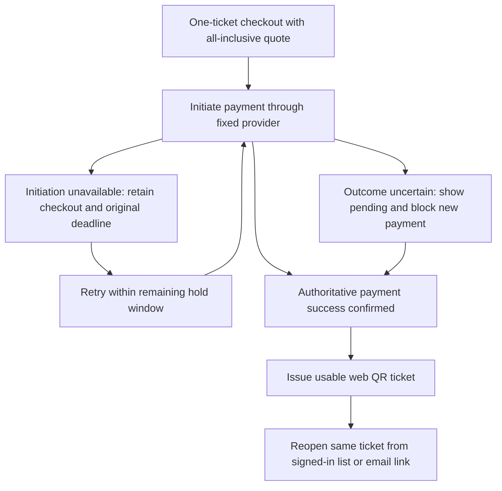

**Encore Booking App**

Engineering requirements specification

Version: 1.0.0-draft.23 · Status: Draft, not approved

Author: Product Owner

Summary: This specification defines the first-release requirements for Encore, a responsive web platform for discovering events, booking tickets, completing payment, receiving digital entry tickets, and supporting organiser operations. It is intended for architects, engineers, testers, and security reviewers. It settles the end-to-end journey for individual and group booking, general-admission ticketing, organiser event and inventory tools, sales visibility, and one-time door check-in. Approved decisions establish one-ticket individual checkout, all-inclusive quoted prices, web QR tickets with signed-in and email-link retrieval, payment uncertainty handling, a uniform 15-minute unpaid hold, no fan-requested refunds, automatic refunds on event cancellation, and organiser-edited rather than dynamic pricing. Fan-to-fan resale remains open. Approved dashboard and gate targets establish sales data no more than 30 seconds old after a paid sale and results for 95% of gate scans within 2 seconds; lifecycle, performance, and recovery decisions are being incorporated section by section.

# 1 Scope and system context
Encore is a concert and festival booking platform for fans, promoters, and venues. The first release supports the journey from event discovery through payment and usable digital entry ticket for one event at a time, together with organiser event, inventory, sales, and check-in capabilities.
## 1.1 In-scope and out-of-scope capabilities
In scope are responsive web event browsing and search, event details with ticket types and prices, individual booking, group booking with shared invitations and separate member payment, digital ticket issuance, organiser event creation and publishing, general-admission ticket types with capacity and price, live sales visibility, and one-time door check-in. Multi-event bundles, season passes, seated maps and seat selection, loyalty or rewards, organiser payout or accounting tooling beyond the payment provider, a new identity system, owned payment rails, and a native mobile app are out of scope for the first release.
## 1.2 System boundary and external dependencies
Production and isolated staging — rehearse before release

Current mainstream desktop and mobile browsers — broad web coverage
# 2 User and organiser functional requirements
Fans must be able to discover and book concert and festival tickets, either alone or as a group, without coordinating payment outside Encore. Organisers must be able to create and publish events, manage general-admission ticket inventory, observe sales, and check fans in.
## 2.1 Event discovery and event details
Optional device location with manual fallback — fan chooses

Partial names and typo tolerance — broader matches

Core facts plus entry rules — include age/access restrictions

Keep visible and label sold out — fans can still find details
## 2.2 Individual booking, payment, and ticket issuance
Individual checkout covers one attendee purchasing one ticket for one event. Encore must provide the following booking, payment, and ticket-delivery behavior.

- **ERS-2.2-01 — Checkout quantity.** Each individual checkout must purchase exactly one ticket of the selected ticket type. It must not support a multi-ticket or mixed-type order.
- **ERS-2.2-02 — Payable price.** Before payment, Encore must show the all-inclusive ticket price as the total payable amount. The payment amount must match that displayed total; additional charges must not be added later in checkout.
- **ERS-2.2-03 — Active price quote.** An organiser's price edit must not change the quoted amount for an existing checkout before that checkout expires. Payment within the active checkout must use its retained quote, rather than the subsequently edited ticket price. Organiser pricing controls are specified in section 2.4.
- **ERS-2.2-04 — Online payment and confirmation.** Checkout must use the already-integrated payment provider under the unchanged integration contract described in section 4.2. Ticket issuance must depend on authoritative payment-success evidence from a provider callback or verified server-side query, not solely on a browser payment result.
- **ERS-2.2-05 — Uncertain payment outcome.** When payment status is uncertain, Encore must show the fan a pending screen and block a new payment for that checkout until the outcome is resolved. An uncertain outcome must not be presented as a failed payment or as a completed ticket purchase.
- **ERS-2.2-06 — Payment initiation outage.** If payment initiation is unavailable before a charge has been initiated, Encore must retain the checkout and its original inventory-hold deadline, allowing initiation to be retried within the remaining hold window. The outage must not extend or reset that deadline. The uniform unpaid hold is 15 minutes, as specified in section 2.3. An uncertain outcome after initiation must instead follow ERS-2.2-05.
- **ERS-2.2-07 — Usable ticket delivery.** At least 95% of confirmed payments must show the fan a usable digital ticket within 10 seconds of payment confirmation, under the supported workload in section 6.1. The first-release ticket must be a web QR ticket usable by the venue check-in flow; wallet integration is not required. A payment confirmation or issuance-pending message alone is not a usable ticket.
- **ERS-2.2-08 — Retrieval after checkout.** Fans must be able to leave checkout and reopen the same issued ticket through both the signed-in ticket list and an email link. Ticket retrieval must not require another purchase or depend on keeping the original checkout page open.

The following flow distinguishes an unavailable initiation from an initiated payment whose outcome is unknown. It shows only the approved branches; expiry, late payment success, cancellation, and paid-but-unissued recovery are governed by sections 3.1, 3.2, and 6.2.

Verification must demonstrate the one-ticket restriction, agreement between the displayed total and payment amount, and preservation of an active quote after an organiser price edit. Fault tests must distinguish initiation unavailability from an uncertain payment outcome, prove that initiation retries retain the original hold deadline, and prove that an uncertain outcome blocks a new payment. Instrumented client-to-result tests must verify the payment-to-usable-ticket target, and retrieval tests must reopen the same ticket through each route after leaving checkout. Recovery and late-payment tests must follow the lifecycle and consistency requirements rather than assuming every confirmed payment can immediately be fulfilled.
## 2.3 Group booking
At each member's checkout — invitation alone reserves nothing

Every unpaid checkout hold lasts 15 minutes, the same for every event. When that time ends, the seats go back on sale. The first release does not let an organiser choose a different hold.

Any signed-in link holder — freely shareable invitation

Any available type for the event — independent tier choices

Starter closes invitations — complete the shared invite manually

Leave and release any unpaid hold immediately — free inventory

Starter may disable new joins — existing memberships remain
## 2.4 Organiser event and inventory management
No dynamic pricing — prices change only through organiser edits

Core facts, saleable types and entry rules — fuller readiness gate

Type capacities under an event ceiling — enforce both limits

Reduce no lower than sold plus held tickets — protect reservations

Keep the quoted price until checkout expires — protect active quotes
## 2.5 Sales dashboard and door check-in
Paid sales plus held/available inventory — operational stock view

Dashboard sales figures are at most 30 seconds old after a paid sale.

Distinct rejection reasons — staff know why entry failed

Retain pending scan for online retry — no admission until confirmed

Keep last figures with stale warning and timestamp — preserve context
# 3 Lifecycle, data, and consistency requirements
The first release must represent the progression from event discovery through booking and payment to digital ticket use at entry. Group booking must expose member participation and payment status to the group starter and organiser.
## 3.1 Booking and ticket lifecycle
No fan-requested refunds — purchases are final

Invalidate tickets and refund automatically — return payment

Keep purchase paid and recover issuance automatically — no new payment

Best-effort cancel; committed success remains valid — reconcile final result
## 3.2 Inventory and check-in consistency
First committed scan wins — other requests return already used

First committed reservation wins — later requests fail availability

Reallocate if stock remains; otherwise reverse payment — preserve capacity

Paid booking and stock atomically; ticket uses explicit pending state — staged fulfilment
## 3.3 Data retention and recovery
Keep ticket and payment records for 7 years so payment disputes can be checked. Keep gate admission records for 90 days after the event, then delete them. Identity stays with the existing identity provider and is not copied into a second store.

Automatically reconcile from provider evidence — isolate only unresolved cases

No loss of committed purchase/admission records — durable core state
# 4 Interfaces and delegated authority
Encore delegates sign-in and payment to fixed external providers while retaining responsibility for booking, group coordination, ticket presentation, organiser tooling, and check-in behavior.
## 4.1 Identity and role permissions
Fan, organiser and gate staff — separate event-scoped entry authority

Existing provider-managed groups — reuse established grants

Next request uses current permissions — immediate effective revocation

Recheck before commit — reject newly unauthorised work

Event organisers for non-financial recovery — platform handles payment corrections
## 4.2 Payment and ticket interfaces
Web QR ticket — no wallet integration required

The first release uses the payment provider Encore already integrates with. That provider's current contract is the one Encore follows. Encore does not add a second contract and does not change the adapter.

Callback or verified server query — either authoritative evidence suffices
## 4.3 Client and organiser-facing contracts
Encore's fan and organiser-facing web contracts must expose distinguishable failures and remain compatible with first-release clients across deployments.

- **ERS-4.3-01 — Typed failures.** Client-facing failures must use stable, machine-readable error categories that distinguish validation, access, conflict, and outage. Clients must be able to identify the category without interpreting human-readable message text.
- **ERS-4.3-02 — Category meaning.** Validation errors must identify requests that fail input requirements; access errors must identify actions the caller is not permitted to perform; conflict errors must identify requests that cannot succeed against the current state; and outage errors must identify unavailable processing or dependencies. These categories must remain distinguishable in both fan and organiser flows. A category alone must not override the action-specific retry, pending-state, or recovery behavior defined elsewhere in this specification.
- **ERS-4.3-03 — Compatible evolution.** Deployed changes to client-facing contracts must be additive and backward compatible with first-release web clients. Existing requests, responses, and error-category meanings must remain usable by older first-release clients after deployment. An additive change must not require those clients to supply a new mandatory input or understand a new response field to continue their existing flows.

Verification must exercise each error category and demonstrate that clients can distinguish it from the other categories. Compatibility tests must run existing first-release client flows against the changed contracts and verify that added fields or capabilities do not break those flows or alter the established error meanings.

The approved decisions do not prescribe error-code identifiers, payload schemas, or HTTP-status mappings; those interface details remain to be specified consistently with these requirements.
# 5 Security and privacy controls
Minimal starter view, richer organiser view — audience-specific fields

Explicit acknowledgement before joining — separate consent step

References, amounts and statuses only — exclude payment-method details

Opaque unguessable reference with server lookup — no ticket data in code

All privileged changes plus admission decisions — full event-day trail
# 6 Performance, capacity, and reliability
Encore must expose operational signals that reveal both explicit failures and lifecycle work that stops progressing without reporting a failure. Background recovery must operate within a shared concurrency limit. User-visible performance and overload behavior are specified in section 6.1; recovery, retry, and interruption behavior are specified in section 6.2.

- **ERS-6-01 — Failure visibility.** Encore must expose flow failure rates to operations so that unsuccessful processing can be distinguished from successful processing.
- **ERS-6-02 — Stuck-state visibility.** Encore must also expose the age and backlog of lifecycle work that is stuck awaiting progress or resolution. Failure-rate signals alone are insufficient: operations must be able to observe accumulating or ageing unresolved work even when no new failure is reported.
- **ERS-6-03 — Recovery concurrency.** No more than 10 background recovery jobs may run at once across Encore. This is a shared limit, not a separate allowance of 10 for each event or recovery work type. Pending work must not start if doing so would exceed the limit. The limit does not change the retry budgets or unresolved-state handling specified in section 6.2.

Verification must demonstrate that reported failures affect the exposed failure-rate signals and that stalled lifecycle work remains observable through its age and backlog even without further errors. Concurrency tests must make more than 10 recovery jobs eligible to run and confirm that the total running count never exceeds 10, including when different recovery work types compete for execution.

The approved decisions do not specify metric aggregation windows, thresholds for identifying a stuck state, alert thresholds, or a scheduling policy for pending recovery work. These details remain unresolved; no numerical monitoring thresholds or scheduling guarantees are established here.
## 6.1 Entry and booking performance
Encore must meet the following performance and capacity requirements for the first-release, single-event workload.

- **ERS-6.1-01 — Supported workload.** Encore must support one event at a time with 2,000 fans browsing, 200 checkouts in a minute, and 20 gate scans per second. This is the supported workload profile for the response-time targets below, not a commitment to concurrent-event capacity.
- **ERS-6.1-02 — Gate response time.** At least 95% of gate scans must show staff a result within 2 seconds. A scan that takes longer must remain visibly pending and must not be treated as an admission while pending. A pending indication is not a completed scan result.
- **ERS-6.1-03 — Payment-to-ticket time.** At least 95% of confirmed payments must show the fan a usable ticket within 10 seconds of payment confirmation. Leaving the checkout must not prevent the fan from reopening the same ticket through the signed-in ticket list or the email link.
- **ERS-6.1-04 — Booking overload.** When booking processing capacity is exhausted, Encore must promptly reject new checkout requests and show retry guidance. It must not place those requests into a hidden waiting queue. This requirement concerns processing capacity, rather than ticket inventory availability.
- **ERS-6.1-05 — Gate capacity protection.** Encore must protect capacity for gate work so that booking load cannot consume it. Booking spikes must not remove the capacity reserved for gate validation; the implementation mechanism is not prescribed here.

Verification must use instrumented client-to-result tests, as specified in section 7, to measure user-visible gate results and usable-ticket availability under the supported workload. Capacity verification must also demonstrate explicit checkout rejection at booking saturation and preservation of protected gate capacity during booking spikes. The approved overload behavior does not specify a numerical rejection-time bound.
## 6.2 Failure recovery and idempotency
Stable checkout-attempt identifier — retries reuse one purchase

Periodic reconciliation of persisted deadlines — recover missed cleanup

Transient network/service failures only — permanent errors stop

Stop a recovery job after 5 attempts or 2 minutes, whichever comes first.

Pause and preserve unresolved state — await operator resolution

Booking and gate scan are usable again within 15 minutes after an outage. A scan during the outage is not treated as admitted.

Replay by scan-request identifier — recover original result

Preserve and resume all active state — compatible migrations required
# 7 Verification and acceptance
Release acceptance must be supported by observable evidence against the mandatory requirements in this specification. Sections 7.1 and 7.2 define the end-to-end journeys and negative, fault, restart, and concurrency verification that contribute to that evidence.

- **ERS-7-01 — Performance measurement.** Performance acceptance must use instrumented client-to-result tests that measure user-visible waits, rather than server or API timings alone. Tests must apply the supported workload and targets in section 6.1. Gate timing must end when staff can see the completed scan result; a pending indication must not count as that result. Payment-to-ticket timing must measure from confirmed payment to a usable ticket shown to the fan; payment confirmation or an issuance-pending message must not count as usable-ticket delivery. Evidence must retain the measured waits and the proportion meeting each approved target.
- **ERS-7-02 — Mandatory release gate.** Every mandatory acceptance criterion must have passing evidence before release. A failed criterion or missing passing evidence must block release; success on other criteria must not compensate for it. The release evidence must identify each mandatory criterion and its corresponding test result, including the journeys in section 7.1 and fault verification in section 7.2.
- **ERS-7-03 — Exception authority.** Any approval of an exception to release criteria must be made by the Product Owner with Risk Manager review. Risk Manager review alone is not exception approval, and the existence of this authority must not be treated as an automatic waiver of an unmet criterion.

**Unresolved policy interaction:** The approved decisions require complete passing evidence for every mandatory criterion and also identify authority for exceptions. They do not establish which, if any, mandatory criteria can be waived or how an approved exception would alter the release gate. Until that interaction is resolved by the owner, this specification retains the mandatory blocking rule and does not define an exception path that permits release without complete passing evidence.
## 7.1 End-to-end acceptance journeys
Release acceptance must demonstrate each core journey end to end and a linked event-day scenario that proves their interaction for the same event. Isolated feature tests are not sufficient. The following journeys verify the behavior specified in sections 2–6; they do not introduce additional product scope.

- **ERS-7.1-01 — Discovery to individual admission.** Starting with a published event and available inventory, a fan must be able to browse or search, view the event details, ticket types and all-inclusive price, select one ticket, and pay through the fixed provider. The test must demonstrate authoritative payment confirmation, issuance of a usable web QR ticket, and retrieval of the same ticket through both the signed-in list and email link after leaving checkout. Event-authorised gate staff must then scan that ticket and observe confirmed admission. A subsequent distinct scan must return already used, with no second admission.
- **ERS-7.1-02 — Group booking to entry.** A starter must be able to create and share an invitation for one event. Signed-in members must acknowledge group-status sharing before joining and choose independently from the event's available ticket types. The test must demonstrate that invitation or membership alone reserves no inventory, each member's checkout creates its own unpaid hold, and members pay for their own tickets within Encore. Each successfully paid member must receive a usable ticket and be able to enter through the gate flow. The test must also demonstrate the starter's invitation-closing control, preservation of existing memberships when new joins are disabled, and the participation and payment-status views permitted for the starter and organiser. Group coordination must not require payment outside Encore.
- **ERS-7.1-03 — Organiser setup and sales visibility.** An event-authorised organiser must create an event, supply the required publication information and entry rules, define saleable ticket types with prices and capacities under the event ceiling, and publish it. The published event must be discoverable with its ticket details. After a purchase, the organiser dashboard must show paid sales and held/available inventory consistent with the booking state, and sales figures must meet the approved freshness requirement in section 2.5.
- **ERS-7.1-04 — Linked event-day scenario.** A linked run must use the same published event and resulting bookings across organiser setup, fan discovery, individual checkout, group invitations and separate member payments, ticket retrieval, sales visibility, and door check-in. Assertions must connect the displayed prices and selected ticket types to the confirmed purchases, inventory changes, issued tickets, and committed admissions. Both individually booked and group-member tickets must work in the event's gate flow. This scenario must demonstrate integration between journeys rather than replacing them with disconnected test fixtures; it does not require an additional full event-day fault rehearsal.
- **ERS-7.1-05 — Integration environment and fault coverage.** Normal payment-to-entry acceptance must exercise the existing payment integration against the provider sandbox. Deterministically emulated failures must supplement that normal-flow evidence and cover the negative, interruption, restart, and concurrency conditions in section 7.2. Emulation alone must not substitute for the sandbox normal flow, and a successful sandbox payment alone must not substitute for fault verification. Acceptance must not depend on provoking unpredictable failures in a live payment service.
- **ERS-7.1-06 — Passing evidence.** Each journey must record its preconditions, actions, expected outcomes, observed client results, and relevant persisted booking, payment, inventory, ticket, and admission state. The linked scenario must retain enough correlation to demonstrate that the same purchases and tickets pass through the connected flows. Timing evidence must use instrumented client-to-result measurements against the approved workload and targets in section 6.1; API-only timing or a pending indication is not evidence of usable-ticket delivery or a completed gate result.

Passing evidence for every mandatory journey and the fault coverage in section 7.2 is required under the release gate in section 7. The approved environment decision establishes sandbox normal flow plus emulated failures; it does not specify a fixture inventory or require a controlled live-payment smoke test.
## 7.2 Negative and fault-condition verification
Negative and fault-condition acceptance must include tests at material contract boundaries and integration tests that exercise restart and concurrency. Boundary tests alone are insufficient to demonstrate lifecycle integrity. These tests are mandatory release criteria under section 7 and supplement the normal journeys in section 7.1.

- **ERS-7.2-01 — Boundary failures.** Tests must exercise invalid inputs, insufficient inventory, payment decline or timeout, invalid or reused ticket references, dependency unavailability, and unauthorised actions. Assertions must use the action-specific requirements in sections 2–6 and verify the distinguishable validation, access, conflict, and outage categories in section 4.3. A timeout or unavailable dependency must not be treated as proof of payment failure or admission success.
- **ERS-7.2-02 — Payment uncertainty and repetition.** Tests must inject lost payment responses and duplicate payment-success callbacks, and repeat purchase requests using the same checkout-attempt identifier. They must demonstrate reuse of one purchase rather than duplicate purchase effects, ticket issuance only from authoritative provider evidence, and a pending fan view that blocks a new payment while the outcome is unresolved. Payment initiation unavailability must retain checkout and the original hold deadline; retries must not reset that deadline.
- **ERS-7.2-03 — Expiry and interrupted fulfilment.** Tests must exercise the 15-minute unpaid-hold boundary and late payment success with both remaining stock and exhausted stock. Expected outcomes are release of expired inventory, reallocation only where stock remains, and payment reversal otherwise, without overselling. Tests must also interrupt member checkout and ticket issuance after confirmed payment. Paid booking and stock must commit atomically; ticket issuance may remain explicitly pending, with the purchase retained as paid and issuance recovered without requiring another payment. In-flight checkout cancellation tests must demonstrate best-effort cancellation and reconciliation of committed success rather than assuming cancellation always wins.
- **ERS-7.2-04 — Restart, restore, and deployment.** Integration tests must interrupt active booking, expiry cleanup, recovery, and admission processing, then restart or restore the system. They must demonstrate no loss of committed purchase or admission records, cleanup from persisted deadlines, and reconciliation against provider evidence where booking and payment disagree. Deployment and rollback tests must demonstrate preservation and resumption of active state with compatible migrations, rather than resetting active bookings or holds.
- **ERS-7.2-05 — Competing mutations.** Integration tests must race bookings for the last available ticket and distinct scan requests for the same ticket. The first committed reservation must win and later bookings must fail availability; the first committed scan must admit and other scan requests must return already used. Tests must also exercise inventory edits concurrent with reservations and payment: ticket-type and event capacity limits must remain enforced, and a capacity reduction must not fall below sold plus held tickets. An organiser price edit must not change an unexpired checkout quote.
- **ERS-7.2-06 — Uncertain gate results.** Tests must lose a response after admission commits and retry with the same scan-request identifier, demonstrating replay of the original result rather than a second admission. Gate validation outages must retain scans as pending for online retry and must not admit while confirmation is unavailable. Scans taking longer than the section 6.1 result-time target must remain pending, not be presented as admitted.
- **ERS-7.2-07 — Authority changes.** Tests must exercise event-scoped access failures and revoke permissions both before a new request and during an uncommitted action. New requests must use current permissions; in-flight work must recheck authority before commit and reject newly unauthorised work. Verification must include the audit records required for privileged changes and admission decisions.
- **ERS-7.2-08 — Recovery and overload limits.** Fault integration tests must distinguish transient failures from permanent errors, stop a recovery job after 5 attempts or 2 minutes, whichever comes first, and preserve unresolved state for operator resolution. With competing recovery work, no more than 10 jobs may run at once. Outage tests must verify the 15-minute booking and gate recovery objective. Booking-saturation tests must demonstrate explicit checkout rejection with retry guidance, no hidden queue, and protected gate capacity. Failure and stuck-state tests must demonstrate the operational signals in section 6; dashboard refresh failures must retain the last figures with a stale warning and timestamp.

Faults must be emulated deterministically, alongside the payment-provider sandbox normal flow specified in section 7.1. Each test must record its preconditions, injected fault or competing operations, expected outcome, observed client result, and relevant persisted state. Evidence must distinguish pending work from committed success and demonstrate that replay or recovery preserves the applicable inventory, purchase, and admission invariants. Timing assertions must use instrumented client-to-result measurements and the approved targets, not substitute API-only timings or introduce new numerical limits.

Passing evidence is required for both boundary tests and restart/concurrency integration tests. This section does not require an additional full event-day resilience rehearsal; the linked event-day acceptance journey remains specified in section 7.1.
# 8 Risks and unresolved decisions
The unresolved decisions are the refund and cancellation policy, whether fan-to-fan ticket resale belongs in the first release, how long an unfinished group booking holds tickets before expiry, and whether dynamic or demand-based pricing is in scope. These decisions affect booking and ticket lifecycle behavior, group inventory handling, and organiser operations. No default policy is specified here.
