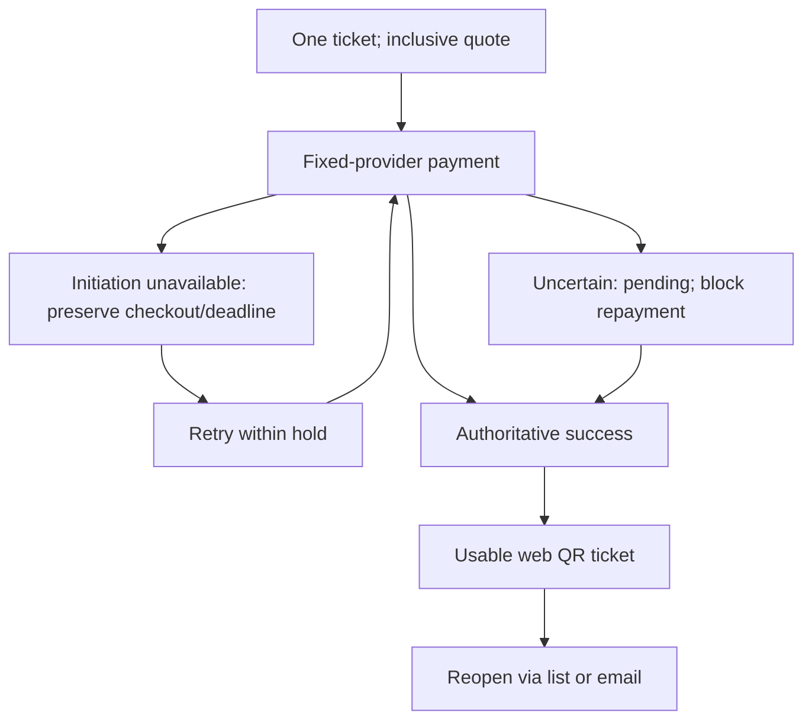
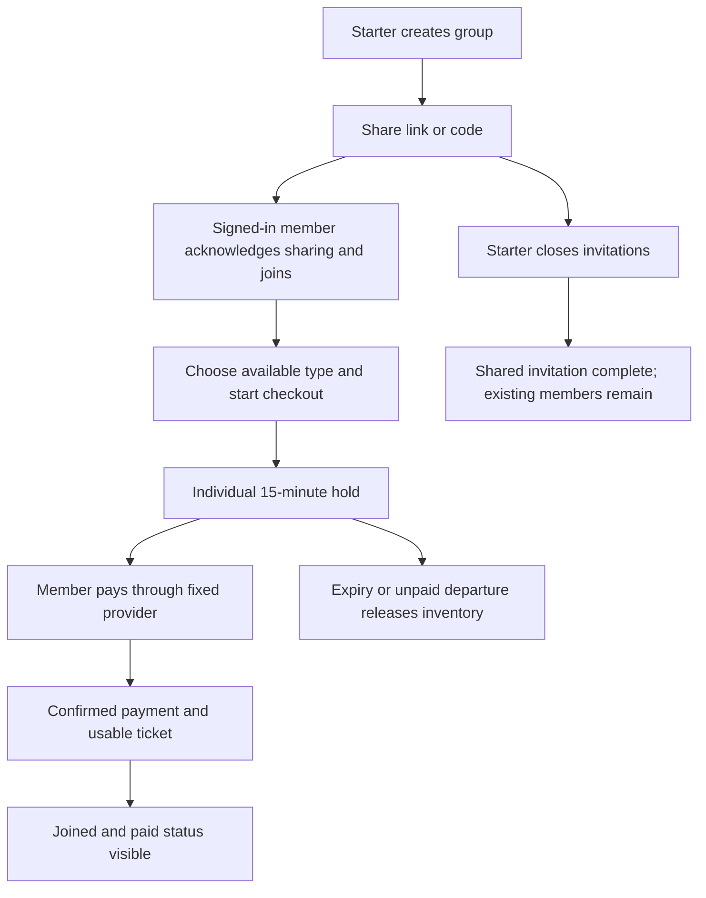

**Encore Booking App**

Engineering requirements specification

Version: 1.0.0 · Status: Approved · Published: 7 October 2026

Author: Product Owner

Summary: Encore is a responsive web platform for discovering concerts and festivals, booking general-admission tickets individually or with friends, paying online, and receiving usable web QR tickets. This specification defines engineering behavior for the discovery-to-entry journey, organiser event and inventory management, live sales visibility, and one-time admission. It establishes separate member payments, 15-minute unpaid holds, retained checkout quotes, final purchases with automatic refunds on event cancellation, and recovery without duplicate purchases or admissions. Performance targets cover ticket delivery, gate results, dashboard freshness, and outage recovery. Fan-to-fan resale, detailed interface definitions, and the interaction between mandatory release criteria and exception authority remain unresolved.

<!-- pie:section sec_4041bdf12508 -->
# 1 Scope and system context
Encore is a concert and festival booking platform for fans, promoters, and venues. The first release supports the journey from event discovery through payment and usable digital entry ticket for one event at a time, together with organiser event, inventory, sales, and check-in capabilities.

Product outcomes are a clear discovery-to-ticket journey without avoidable abandonment, group booking as a natural extension of solo booking, trusted day-of-event sales visibility, and entry without a check-in bottleneck. Encore also aims to reduce support contacts about unscannable tickets and uncertain group booking status. Quantitative usability, abandonment, and support-contact acceptance measures are not yet decided.
<!-- pie:section sec_79c809292eb6 -->
## 1.1 In-scope and out-of-scope capabilities
In scope are responsive web event browsing and search, event details with ticket types and prices, individual booking, group booking with shared invitations and separate member payment, digital ticket issuance, organiser event creation and publishing, general-admission ticket types with capacity and price, live sales visibility, and one-time door check-in. Multi-event bundles, season passes, seated maps and seat selection, loyalty or rewards, organiser payout or accounting tooling beyond the payment provider, a new identity system, owned payment rails, and a native mobile app are out of scope for the first release.
<!-- pie:section sec_cd166dd95da8 -->
## 1.2 System boundary and external dependencies
**SOL_ENVIRONMENT — System boundary.** Encore shall run in production and isolated staging, with staging supporting release rehearsal. The first release shall support current mainstream desktop and mobile browsers through a responsive web experience. Sign-in mechanics remain with the existing identity provider; payment processing remains with the already-integrated provider. Encore retains responsibility for discovery, booking, group coordination, inventory, ticket presentation, sales visibility, and gate validation.

The exact supported browser versions and staging configuration are not yet decided.

**Test Cases:** Environment and browser verification shall demonstrate the responsive core journeys in section 7.1; the browser matrix and implementation paths are not yet decided.
<!-- pie:section sec_4d25fc873241 -->
# 2 User and organiser functional requirements
**Intended Use (anticipated):** Fans shall be able to discover and book concert and festival tickets, individually or with friends, without coordinating payment outside Encore. Organisers shall create and publish events, manage general-admission inventory, observe sales, and check fans in. Intended use spans one event per booking, on responsive web clients using the existing identity and payment providers, with the exclusions in section 1.1.

New SWF, SOL, and TC identifiers in this specification are proposed document identifiers, not claims about repository identities. Requirement and verification records below define obligations and expected outcomes, not observed implementation or passing test results.
<!-- pie:section sec_b9ac7bae5a20 -->
## 2.1 Event discovery and event details
**SWF_DISCOVERY**

Fans discover concerts and festivals near them or by artist and inspect details before booking.

**Variability:** Location discovery shall support optional device location and manual location entry. Search shall support partial names and typo-tolerant matches. Sold-out events remain discoverable.

**Mapping to Software Items:** Allocation to canonical software items is not yet decided.

**Specification — SOL_DISCOVERY:** Encore shall allow event browsing and searching by location or artist. Fans shall choose whether to provide device location and shall have manual fallback. Event details shall present core event facts, ticket types, prices, and entry rules, including age and access restrictions. Sold-out events shall stay visible and carry a sold-out label rather than disappearing.

The exact event-field inventory, search matching rules, and supported location inputs are not yet decided.

**Test Cases — TC_DISCOVERY:**

**Description:** The discovery-to-purchase journey in section 7.1 shall verify discoverability and displayed booking information; matching and location boundary scenarios are not yet decided.

**Test Data:** A published event with available ticket types is required; exact fixtures are not yet decided.

**Test steps:**

| **Action:** | **Expected Result:** |
| --- | --- |
| 1. Browse or search for the published event and open it. | 1. The event is discoverable and its ticket types, all-inclusive prices, and entry rules are visible. |

**Source Code File:** The test implementation path is not yet decided.
<!-- pie:section sec_354d60f652ea -->
## 2.2 Individual booking, payment, and ticket issuance
**SWF_INDIVIDUAL_BOOKING**

Individual checkout covers one attendee and one event.

**Variability:** Initiation unavailability differs from an initiated payment with an uncertain outcome.

**Mapping to Software Items:** Canonical software-item allocation is not yet decided.

**Specification — SOL_INDIVIDUAL_BOOKING:**

- **ERS-2.2-01:** Checkout shall buy one selected-type ticket, excluding multi-ticket and mixed-type orders.
- **ERS-2.2-02:** The displayed all-inclusive total shall equal the charge, without additions.
- **ERS-2.2-03:** Payment shall use the unexpired quote despite organiser edits, per section 2.4.
- **ERS-2.2-04:** Payment shall use section 4.2's unchanged integration; issuance shall require a callback or verified server query, not browser-only evidence.
- **ERS-2.2-05:** Uncertainty shall show pending and block repayment until resolution, indicating neither failure nor completion.
- **ERS-2.2-06:** Unavailable initiation shall preserve checkout and its original 15-minute deadline; retries shall not extend it. Post-initiation uncertainty follows ERS-2.2-05.
- **ERS-2.2-07:** Under section 6.1's workload, 95% of confirmed payments shall show a usable web QR ticket within 10 seconds. Wallet integration is unnecessary; confirmation and pending issuance are not usable tickets.
- **ERS-2.2-08:** After leaving checkout, fans shall reopen the same ticket through the signed-in list or email link without repurchase or the original page.

Expiry, late success, cancellation, and paid-but-unissued recovery follow sections 3.1, 3.2, and 6.2.

**Test Cases — TC_INDIVIDUAL_BOOKING:**

**Description:** Sections 7.1–7.2 shall verify quantity, totals, quotes, deadlines, outage versus uncertainty, blocked payment, ticket timing, retrieval, and lifecycle-consistent recovery/late payment.

**Test Data:** Fixtures are not yet decided.

**Test steps:**

| **Action:** | **Expected Result:** |
| --- | --- |
| 1. Pay for one ticket through the provider sandbox and retrieve it through both routes. | 1. The quoted total is charged; both routes reopen the same usable QR ticket. |

**Source Code File:** The implementation path is not yet decided.
<!-- pie:section sec_6635cf7aba1a -->
## 2.3 Group booking
**SWF_GROUP_BOOKING**

Friends coordinate booking for one event while each member pays for their own ticket inside Encore.

**Variability:** Members independently choose available event ticket types. Any signed-in invitation holder may join while invitations remain open.

**Mapping to Software Items:** Allocation to canonical software items is not yet decided.

**Specification — SOL_GROUP_BOOKING:** Encore shall let a starter create a group and freely share its invitation link or code. Joining requires section 5's acknowledgement. Invitation/membership shall reserve nothing; each checkout shall create a uniform 15-minute unpaid hold, without organiser override. Expiry shall return tickets to sale; leaving shall release unpaid holds immediately. The starter shall manually close invitations to complete the shared invitation and may disable new joins without removing memberships. Joined/paid status shall remain visible to the starter and organiser under section 5. Closure shall not mark unpaid members paid or issue tickets.

The treatment of unpaid members in the final group-completion status is not yet decided.

**Test Cases — TC_GROUP_BOOKING:**

**Description:** Section 7.1 requires group booking through entry, including separate payments and invitation closure.

**Test Data:** A starter, signed-in members, and an event with inventory are required; fixtures are not yet decided.

**Test steps:**

| **Action:** | **Expected Result:** |
| --- | --- |
| 1. Share, join, check out, pay separately, and close invitations. | 1. Only checkout reserves inventory; paid members receive tickets; closure stops new joins and preserves existing memberships. |

**Source Code File:** The test implementation path is not yet decided.
<!-- pie:section sec_c9ee3734e333 -->
## 2.4 Organiser event and inventory management
**SWF_EVENT_MANAGEMENT**

Organisers create and publish events and maintain saleable general-admission inventory.

**Variability:** The first release excludes dynamic or demand-based pricing; ticket prices change only through organiser edits.

**Mapping to Software Items:** Allocation to canonical software items is not yet decided.

**Specification — SOL_EVENT_MANAGEMENT:** Event-authorised organisers shall create events, define ticket types with prices and capacities, and publish events. Publication shall require core event facts, saleable ticket types, and entry rules. Encore shall enforce each ticket-type capacity and the overall event capacity ceiling. Capacity reductions shall not fall below sold plus held tickets at the affected type or event level. An organiser price edit shall leave each existing checkout's quoted price unchanged until that checkout expires; new pricing shall not replace active quotes.

The precise publication-field inventory and validation rules are not yet decided.

**Test Cases — TC_EVENT_MANAGEMENT:**

**Description:** The organiser setup journey in section 7.1 verifies publication and saleable inventory; section 7.2 requires concurrent capacity and quote-preservation checks.

**Test Data:** An authorised organiser and an event with core facts, entry rules, and saleable types are required; exact fixtures are not yet decided.

**Test steps:**

| **Action:** | **Expected Result:** |
| --- | --- |
| 1. Create the event, define ticket types under its capacity ceiling, and publish. | 1. The event becomes discoverable with the configured ticket types and prices. |
| 2. Edit a price while a checkout quote remains active. | 2. The active checkout retains its quoted payable price. |

**Source Code File:** The test implementation path is not yet decided.
<!-- pie:section sec_be352c67bd5a -->
## 2.5 Sales dashboard and door check-in
**SWF_SALES_AND_ENTRY**

Organisers see operational sales and inventory; authorised gate staff validate tickets and admit each ticket once.

**Variability:** Gate outcomes distinguish confirmed admission, rejection, and pending validation. Dashboard refresh failure preserves the last known figures rather than presenting them as current.

**Mapping to Software Items:** Allocation to canonical software items is not yet decided.

**Specification — SOL_SALES_AND_ENTRY:** The dashboard shall show paid sales and held and available inventory. After a paid sale, displayed sales figures shall be at most 30 seconds old. If refresh fails, Encore shall retain the last figures with a stale warning and timestamp. Gate check-in shall distinguish rejection reasons so staff know why entry failed. When online gate validation is unavailable, Encore shall retain the scan as pending for online retry and shall not admit until validation is confirmed. Successful check-in shall mark the ticket used exactly once, subject to section 3.2.

The precise rejection-reason catalogue and dashboard timestamp semantics are not yet decided.

**Test Cases — TC_SALES_AND_ENTRY:**

**Description:** Sections 7.1 and 7.2 require sales visibility, admission, repeated-scan rejection, and unavailable-validation verification.

**Test Data:** A paid purchase and its ticket for the dashboard's event are required; exact fixtures are not yet decided.

**Test steps:**

| **Action:** | **Expected Result:** |
| --- | --- |
| 1. Observe the dashboard following the purchase. | 1. Paid sales and held/available inventory reflect the booking; sales figures satisfy the 30-second freshness target. |
| 2. Scan the ticket, then submit a distinct scan for it. | 2. The first committed scan admits; the later scan returns already used without another admission. |
| 3. Make online validation unavailable and scan. | 3. The scan remains pending for online retry without admission. |

**Source Code File:** The test implementation path is not yet decided.
<!-- pie:section sec_2b58a4727855 -->
# 3 Lifecycle, data, and consistency requirements
The first release must represent the progression from event discovery through booking and payment to digital ticket use at entry. Group booking must expose member participation and payment status to the group starter and organiser.
<!-- pie:section sec_5d3d389d2790 -->
## 3.1 Booking and ticket lifecycle
**Specification — SOL_BOOKING_LIFECYCLE:** Fan purchases shall be final; Encore shall not offer fan-requested refunds. Event cancellation shall invalidate the event's tickets and automatically refund their payments. When payment succeeds but ticket issuance fails, Encore shall retain the purchase as paid and recover issuance automatically without a new payment. Cancelling in-flight checkout shall attempt cancellation on a best-effort basis; if success has already committed, it shall remain valid and Encore shall reconcile the final result rather than assume cancellation won. Event-cancellation invalidation and refunds remain applicable independently of checkout cancellation.

The complete lifecycle state catalogue, event-cancellation authority, and refund completion timing are not yet decided.

**Test Cases:** Section 7.2 requires interrupted issuance and in-flight cancellation tests demonstrating paid-state preservation and reconciliation of committed success. Detailed verification scenarios for fan-refund exclusion and automatic event-cancellation refunds, test fixtures, and implementation paths are not yet decided.
<!-- pie:section sec_81d27b125af1 -->
## 3.2 Inventory and check-in consistency
**Specification — SOL_CONSISTENCY:** When scan requests compete for the same ticket, the first committed scan shall admit and other distinct requests shall return already used. Retrying the same scan-request identifier shall instead replay its original result under section 6.2. When reservations compete for remaining inventory, the first committed reservation shall win and later requests without available stock shall fail availability. If payment succeeds after a hold expires, Encore shall reallocate inventory only if stock remains; otherwise it shall reverse the payment, without exceeding capacity. The paid booking and corresponding inventory change shall commit atomically. Ticket issuance shall use an explicit pending state until fulfilment completes, rather than require issuance to share that atomic commit.

The precise persisted state representation and payment-reversal completion timing are not yet decided.

**Test Cases:** Section 7.2 requires last-ticket reservation races, concurrent scans, late payment with and without available stock, and interrupted issuance. Expected outcomes shall preserve capacity, exactly-once admission, atomic paid booking and stock, and explicit pending issuance. Concrete fixtures and test implementation paths are not yet decided.
<!-- pie:section sec_c99304c2473e -->
## 3.3 Data retention and recovery
**Specification — SOL_DATA_RECOVERY:** Encore shall retain ticket and payment records for 7 years to support payment-dispute investigation. It shall retain gate admission records for 90 days after the event, then delete them. Identity shall remain with the existing identity provider and shall not be copied into a second identity store. Encore shall automatically reconcile inconsistent booking and payment state from authoritative provider evidence and isolate only cases that remain unresolved. Restart and restore shall cause no loss of committed purchase or admission records within their retention periods.

The retention start point for ticket and payment records, deletion mechanics, and restore procedures are not yet decided.

**Test Cases:** Section 7.2 requires restart and restore verification of committed purchase/admission durability and reconciliation from provider evidence. Detailed retention and deletion scenarios, recovery fixtures, and implementation paths are not yet decided.
<!-- pie:section sec_4bba7d52c31e -->
# 4 Interfaces and delegated authority
Encore delegates sign-in and payment to fixed external providers while retaining responsibility for booking, group coordination, ticket presentation, organiser tooling, and check-in behavior.
<!-- pie:section sec_de06e8217062 -->
## 4.1 Identity and role permissions
**Specification — SOL_AUTHORITY:** Encore shall distinguish fan, organiser, and gate-staff permissions, with organiser and entry authority scoped to the relevant event. Existing identity-provider-managed groups shall supply established grants; Encore shall not introduce a separate sign-in system. Each new request shall use current permissions so revocation takes effect on the next request. Before committing in-flight work, Encore shall recheck permissions and reject work that has become unauthorised. Event organisers may perform non-financial booking recovery for their events; payment corrections shall remain platform-controlled rather than organiser-controlled.

The exact role-to-action matrix, group-to-event grant mapping, permitted recovery actions, and platform payment-correction authority are not yet decided.

**Test Cases:** Section 7.2 requires event-scoped access failures, revocation before requests and before in-flight commit, and audit verification. Requests and newly unauthorised commits shall be rejected. Exact identity fixtures and test implementation paths are not yet decided.
<!-- pie:section sec_f682734bcc8a -->
## 4.2 Payment and ticket interfaces
**Specification — SOL_PAYMENT_TICKET_INTERFACE:** The first release shall issue web QR tickets; wallet integration is not required. It shall use the payment provider Encore already integrates with and follow that provider's current contract. Encore shall neither add a second payment contract nor change the adapter. A provider callback or a verified server-side query shall each suffice as authoritative payment evidence. A browser-only result shall not authorise ticket issuance. QR content and lookup shall follow section 5.

Concrete provider contract identifiers and interface definitions are not specified here; callback verification and payment-status mappings shall follow the existing provider contract, not a newly selected contract. The QR encoding is not yet decided.

**Test Cases:** Section 7.1 requires sandbox payment-to-entry acceptance using the existing integration; section 7.2 requires duplicate callbacks and uncertain outcomes. Verification shall show issuance from authoritative evidence without duplicate purchase effects. Contract fixtures and implementation paths are not yet decided.
<!-- pie:section sec_731da12cd8be -->
## 4.3 Client and organiser-facing contracts
**Specification — SOL_CLIENT_CONTRACTS:** Encore's fan and organiser-facing web contracts must expose distinguishable failures and remain compatible with first-release clients across deployments.

- **ERS-4.3-01 — Typed failures.** Client-facing failures must use stable, machine-readable error categories that distinguish validation, access, conflict, and outage. Clients must be able to identify the category without interpreting human-readable message text.
- **ERS-4.3-02 — Category meaning.** Validation errors must identify requests that fail input requirements; access errors must identify actions the caller is not permitted to perform; conflict errors must identify requests that cannot succeed against the current state; and outage errors must identify unavailable processing or dependencies. These categories must remain distinguishable in both fan and organiser flows. A category alone must not override the action-specific retry, pending-state, or recovery behavior defined elsewhere in this specification.
- **ERS-4.3-03 — Compatible evolution.** Deployed changes to client-facing contracts must be additive and backward compatible with first-release web clients. Existing requests, responses, and error-category meanings must remain usable by older first-release clients after deployment. An additive change must not require those clients to supply a new mandatory input or understand a new response field to continue their existing flows.

**Test Cases:** Verification must exercise each error category and demonstrate that clients can distinguish it from the other categories. Compatibility tests must run existing first-release client flows against the changed contracts and verify that added fields or capabilities do not break those flows or alter the established error meanings. The test fixtures and implementation paths are not yet decided.

Error-code identifiers, payload schemas, and HTTP-status mappings are not yet decided; those interface details must remain consistent with these requirements.
<!-- pie:section sec_b302cbf5d0b9 -->
# 5 Security and privacy controls
**Specification — SOL_SECURITY_PRIVACY:** Group visibility shall be audience-specific: the starter shall receive a minimal participation/payment-status view, while the event organiser shall receive a richer operational view. Before joining, each member shall explicitly acknowledge sharing group status in a separate consent step. Encore's payment records and views shall contain references, amounts, and statuses only, excluding payment-method details. Each ticket QR code shall contain an opaque, unguessable reference resolved through server lookup, not embedded ticket data. Encore shall audit all privileged changes and admission decisions to provide an event-day trail. Access shall follow the event-scoped permissions in section 4.1.

The exact audience-specific fields, acknowledgement wording, reference-strength criteria, audit fields and retention, and remaining security controls are not yet decided.

**Test Cases:** Section 7.1 requires acknowledgement before group joining and audience-appropriate views. Section 7.2 requires access and revocation checks plus privileged-change and admission audit evidence. Detailed payment-data exclusion and QR privacy scenarios, fixtures, and implementation paths are not yet decided.
<!-- pie:section sec_09e91bf114fc -->
# 6 Performance, capacity, and reliability
**Specification — SOL_OPERATIONS:** Encore must expose operational signals that reveal both explicit failures and lifecycle work that stops progressing without reporting a failure. Background recovery must operate within a shared concurrency limit. User-visible performance and overload behavior are specified in section 6.1; recovery, retry, and interruption behavior are specified in section 6.2.

- **ERS-6-01 — Failure visibility.** Encore must expose flow failure rates to operations so that unsuccessful processing can be distinguished from successful processing.
- **ERS-6-02 — Stuck-state visibility.** Encore must also expose the age and backlog of lifecycle work that is stuck awaiting progress or resolution. Failure-rate signals alone are insufficient: operations must be able to observe accumulating or ageing unresolved work even when no new failure is reported.
- **ERS-6-03 — Recovery concurrency.** No more than 10 background recovery jobs may run at once across Encore. This is a shared limit, not a separate allowance of 10 for each event or recovery work type. Pending work must not start if doing so would exceed the limit. The limit does not change the retry budgets or unresolved-state handling specified in section 6.2.

**Test Cases:** Verification must demonstrate that reported failures affect the exposed failure-rate signals and that stalled lifecycle work remains observable through its age and backlog even without further errors. Concurrency tests must make more than 10 recovery jobs eligible to run and confirm that the total running count never exceeds 10, including when different recovery work types compete for execution. Concrete fixtures and implementation paths are not yet decided.

Metric aggregation windows, thresholds for identifying a stuck state, alert thresholds, and the scheduling policy for pending recovery work are not yet decided. These details remain unresolved; no numerical monitoring thresholds or scheduling guarantees are established here.
<!-- pie:section sec_0a2b7a4ee47c -->
## 6.1 Entry and booking performance
**Specification — SOL_PERFORMANCE:** Encore must meet the following performance and capacity requirements for the first-release, single-event workload.

- **ERS-6.1-01 — Supported workload.** Encore must support one event at a time with 2,000 fans browsing, 200 checkouts in a minute, and 20 gate scans per second. This is the supported workload profile for the response-time targets below, not a commitment to concurrent-event capacity.
- **ERS-6.1-02 — Gate response time.** At least 95% of gate scans must show staff a result within 2 seconds. A scan that takes longer must remain visibly pending and must not be treated as an admission while pending. A pending indication is not a completed scan result.
- **ERS-6.1-03 — Payment-to-ticket time.** At least 95% of confirmed payments must show the fan a usable ticket within 10 seconds of payment confirmation. Leaving the checkout must not prevent the fan from reopening the same ticket through the signed-in ticket list or the email link.
- **ERS-6.1-04 — Booking overload.** When booking processing capacity is exhausted, Encore must promptly reject new checkout requests and show retry guidance. It must not place those requests into a hidden waiting queue. This requirement concerns processing capacity, rather than ticket inventory availability.
- **ERS-6.1-05 — Gate capacity protection.** Encore must protect capacity for gate work so that booking load cannot consume it. Booking spikes must not remove the capacity reserved for gate validation; the implementation mechanism is not prescribed here.

**Test Cases:** Verification must use instrumented client-to-result tests, as specified in section 7, to measure user-visible gate results and usable-ticket availability under the supported workload. Capacity verification must also demonstrate explicit checkout rejection at booking saturation and preservation of protected gate capacity during booking spikes. A numerical rejection-time bound, workload fixtures, and test implementation paths are not yet decided.
<!-- pie:section sec_abcb34b60793 -->
## 6.2 Failure recovery and idempotency
**Specification — SOL_FAILURE_RECOVERY:** Encore shall use a stable checkout-attempt identifier so retries reuse one purchase. It shall periodically reconcile persisted hold deadlines to recover missed expiry cleanup. Automatic retries shall apply only to transient network or service failures; permanent errors shall stop retrying. A recovery job shall stop after 5 attempts or 2 minutes, whichever occurs first, then pause and preserve unresolved state for operator resolution. Across these jobs, the concurrency limit in section 6 applies.

Booking and gate scanning shall become usable again within 15 minutes after an outage. A scan during the outage shall not count as admission. Retrying a scan with its original scan-request identifier shall replay the original result, including a committed result whose response was lost, rather than create another admission. Deployment and rollback shall preserve and resume all active state through compatible migrations, including bookings, holds, payment uncertainty, pending issuance, and scan processing.

The reconciliation interval, retry schedule, precise attempt/time-budget accounting, and outage measurement origin are not yet decided.

**Test Cases:** Section 7.2 requires repeated purchase requests, missed cleanup, lost scan responses, restart/restore, deployment/rollback, transient versus permanent failures, exhausted budgets, preserved unresolved state, and outage recovery. Verification shall assert the stated limits and durable state without equating pending work with success. Concrete fixtures and test implementation paths are not yet decided.
<!-- pie:section sec_69a5e3307e09 -->
# 7 Verification and acceptance
**Specification — SOL_RELEASE_ACCEPTANCE:** Release acceptance must be supported by observable evidence against the mandatory requirements in this specification. Sections 7.1 and 7.2 define the end-to-end journeys and negative, fault, restart, and concurrency verification that contribute to that evidence.

- **ERS-7-01 — Performance measurement.** Performance acceptance must use instrumented client-to-result tests that measure user-visible waits, rather than server or API timings alone. Tests must apply the supported workload and targets in section 6.1. Gate timing must end when staff can see the completed scan result; a pending indication must not count as that result. Payment-to-ticket timing must measure from confirmed payment to a usable ticket shown to the fan; payment confirmation or an issuance-pending message must not count as usable-ticket delivery. Evidence must retain the measured waits and the proportion meeting each approved target.
- **ERS-7-02 — Mandatory release gate.** Every mandatory acceptance criterion must have passing evidence before release. A failed criterion or missing passing evidence must block release; success on other criteria must not compensate for it. The release evidence must identify each mandatory criterion and its corresponding test result, including the journeys in section 7.1 and fault verification in section 7.2.
- **ERS-7-03 — Exception authority.** Any approval of an exception to release criteria must be made by the Product Owner with Risk Manager review. Risk Manager review alone is not exception approval, and the existence of this authority must not be treated as an automatic waiver of an unmet criterion.

**Unresolved policy interaction:** Which mandatory criteria, if any, can be waived and how exception approval changes the release gate are not yet decided. The complete-passing-evidence rule remains in force; identifying exception authority does not establish a path to release without that evidence.

**Test Cases:** Acceptance shall review criterion-to-result coverage and instrumented user-visible timing evidence from sections 7.1–7.2. Exact evidence-review procedures and test implementation paths are not yet decided.
<!-- pie:section sec_e92bc7eef078 -->
## 7.1 End-to-end acceptance journeys
**Specification — SOL_ACCEPTANCE_JOURNEYS:** Core journeys and their linked same-event interaction shall pass under section 7; isolated tests are insufficient. Verification adds no product scope.

**Test Cases — TC_CORE_AND_LINKED_JOURNEYS:**

**Description:** Normal and linked event-day journeys shall verify sections 2–6. Whether an additional event-day fault rehearsal is required is not yet decided.

**Test Data:** The linked run requires one published event, available types, authorised organisers/gate staff, fans, and correlated purchases/tickets. Fixtures are not yet decided.

**Test steps:**

| **Action:** | **Expected Result:** |
| --- | --- |
| 1. ERS-7.1-03: create/publish with required facts, entry rules, priced types, and capacities; observe sales. | 1. Details are discoverable; paid sales and held/available inventory match bookings and section 2.5 freshness. |
| 2. ERS-7.1-01: browse/search, inspect details/total, buy one ticket, leave checkout, retrieve through both routes, and scan twice. | 2. Authoritative provider payment yields usable QR; list/email reopen it; authorised first scan admits, distinct repeat returns already used. |
| 3. ERS-7.1-02: share, acknowledge sharing, join, choose types independently, pay separately, close invitations, and enter. | 3. Membership reserves nothing; checkout holds stock; in-app payments yield usable tickets/admission. Closure preserves memberships; starter/organiser status views respect privacy. |
| 4. ERS-7.1-04: connect organiser setup, discovery, solo/group payment, retrieval, sales, and entry for the same event. | 4. Quotes/types correlate with purchases, stock, tickets, and admissions; solo/group tickets work without disconnected fixtures. |
| 5. ERS-7.1-05: use the existing provider sandbox normally and emulate section 7.2 faults deterministically. | 5. Both evidence sets exist; neither substitutes for the other or requires unpredictable live failures. |
| 6. ERS-7.1-06: record preconditions, actions, expectations, client observations, and persisted booking/payment/inventory/ticket/admission state. | 6. Correlation proves linked flows; instrumented timings meet section 6.1, excluding API-only timing and pending indications. |

**Source Code File:** Test implementation paths are not yet decided.

Passing journey and fault evidence is mandatory. Whether a controlled live-payment smoke test is required is not yet decided.
<!-- pie:section sec_dafb3edf8db2 -->
## 7.2 Negative and fault-condition verification
**Specification — SOL_FAULT_VERIFICATION:** Boundary and restart/concurrency integration tests shall pass under section 7; boundary-only evidence is insufficient. Deterministic faults shall supplement sandbox journeys. Whether a separate event-day resilience rehearsal is required is not yet decided.

**Test Cases — TC_LIFECYCLE_FAULTS:**

**Description:** Failure/replay/recovery shall preserve inventory, purchase, and admission invariants, distinguishing pending from committed work.

**Test Data:** Tests shall record preconditions, faults/competing operations, expectations, client observations, and persisted state. Fixtures are not yet decided.

**Test steps:**

| **Action:** | **Expected Result:** |
| --- | --- |
| 1. ERS-7.2-01: submit invalid inputs/references, insufficient stock, declines/timeouts, reused tickets, unavailable dependencies, and unauthorised actions. | 1. Action-specific outcomes/typed errors apply; timeout/outage proves neither failed payment nor admission. |
| 2. ERS-7.2-02: lose payment responses, duplicate callbacks, repeat checkout identifiers, and interrupt initiation. | 2. Authoritative evidence yields one purchase; uncertainty blocks payment; initiation retries preserve checkout/deadline. |
| 3. ERS-7.2-03: expire 15-minute holds, confirm late payments with/without stock, interrupt checkout/issuance, and cancel checkout. | 3. Stock releases; late success reallocates or reverses without overselling. Paid booking/stock commit atomically; pending issuance recovers without repayment. Cancellation reconciles committed success. |
| 4. ERS-7.2-04: interrupt booking/cleanup/recovery/admission; restart/restore, deploy, and roll back. | 4. Purchases/admissions survive; persisted deadlines recover cleanup; provider evidence reconciles inconsistencies; compatible migrations preserve/resume active state. |
| 5. ERS-7.2-05: race last-ticket reservations/scans and inventory/price edits against reservations/payment. | 5. First commits win; losers fail availability/already-used. Type/event limits, sold-plus-held minima, and active quotes hold. |
| 6. ERS-7.2-06: lose committed scan responses, retry identifiers, interrupt validation, and delay results. | 6. Results replay; unconfirmed scans remain pending for online retry without admission. |
| 7. ERS-7.2-07: deny event access and revoke permissions before requests/commit. | 7. Current permissions apply; newly unauthorised work fails; privileged changes/admissions are audited. |
| 8. ERS-7.2-08: inject transient/permanent failures, exhaust budgets, compete for recovery, and cause outage/saturation/stalls/dashboard failure. | 8. Section 6 limits enforce retry stops, preserved state, 10-job concurrency, 15-minute recovery, explicit checkout rejection/guidance without queues, protected gates, operational signals, and stale figures/warning/timestamp. |

Timings shall use instrumented client-to-result measurements and established targets, not API-only timings or new limits.

**Source Code File:** Test implementation paths are not yet decided.
<!-- pie:section sec_a0b7877c693f -->
# 8 Risks and unresolved decisions
Fan-requested refunds are excluded, event cancellation invalidates tickets and triggers automatic refunds, unpaid checkout holds last 15 minutes, and dynamic or demand-based pricing is excluded from the first release. These decisions govern booking and ticket lifecycle behavior, group inventory handling, and organiser operations; they are not unresolved policy defaults.

Whether fan-to-fan ticket resale belongs in the first release is not yet decided. The final group-completion status when existing members remain unpaid, detailed event-cancellation and refund procedures, and the interaction between mandatory release criteria and exception authority are not yet decided. No default is established for these unresolved choices.

Exact browser versions, publication fields, search rules, interface schemas, software-item allocations, security-control details, retention mechanics, monitoring thresholds, retry scheduling, measurement conventions, and test fixtures and implementation paths are not yet decided. Missing these details limits implementation and verification precision; expected verification outcomes in this specification are not evidence of executed or passing tests.
